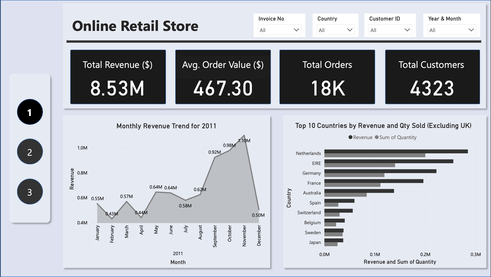
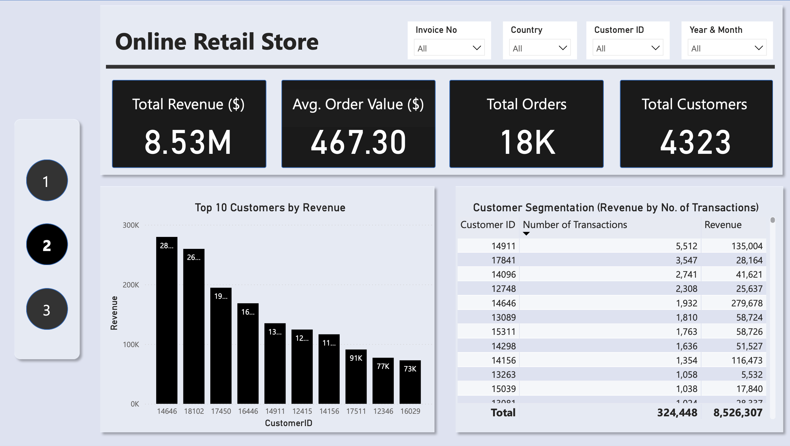
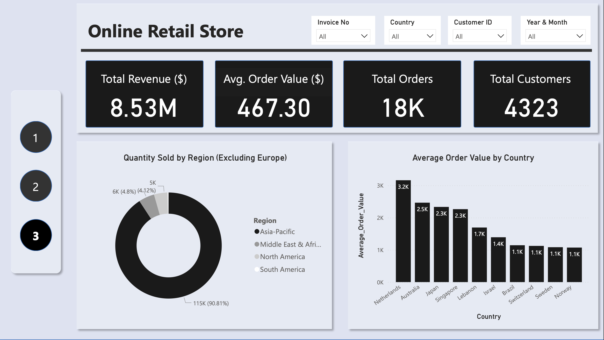

# Online Retail Store Sales Analysis

## Project Overview
This project explores online retail store sales data to uncover purchasing patterns, customer behavior, and revenue trends. Using Excel for data cleaning and Power BI for visualization, I identified key insights that can help businesses optimize inventory management, customer engagement, and sales performance.


## Dataset
Source: Tata on Forage
Original dataset: Online_Retail.xlsx


## Data Cleaning & Preparation (Excel)
Before analysis, I conducted a thorough data cleaning process in Excel:

**1. Method used: Filters & conditional formulas**
1. Open my dataset in Excel.

2. Selected the entire dataset, then go to Data > Filter to enable filtering.

3. Filtered out invalid values:

- Blank or invalid "Description" values (e.g., ‘??’):
- - Clicked the filter dropdown on the Description column.
- - Unchecked (Blanks) and any invalid value like "??".

- Blank "CustomerID" values:
- - Clicked the filter dropdown on the CustomerID column.
- - Unchecked (Blanks).

- Unspecified "Country" values:
- - Clicked the filter dropdown on the Country column.
- - Unchecked "Unspecified".

- Negative "UnitPrice" values:
- - Clicked the filter dropdown on the UnitPrice column.
- - Chose number filters > Greater Than and enter 0.

- Invalid "Quantity" values (below 1):
- - Clicked the filter dropdown on the Quantity column.
- - Chose number filters > Greater Than or Equal To and enter 1.

4. Copied and pasted the filtered data into a new sheet to preserve the cleaned version.

**2. Standardized column names**
All the  column names were already standardized for consistentency.

**3. Validated data types**
- Ensured numerical columns (e.g., Quantity, Price_per_Unit) were correctly formatted as numbers.
- Ensured that the Date column (InvoiceDate) was in DateTime format.


## Final Cleaned Dataset:
Cleaned dataset file: Cleaned_Online_Retail_Dataset.xlsx


## Exploratory Data Analysis (EDA) & Insights (Power BI)
**KPI**
- Total revenue
- Average order value
- Total orders
- Total customers

**1. Sales Performance Trends**

📌 How do revenue fluctuate over time?
💡 Insight: The highest revenue weas recorded during Q4, with October(0.98M) and November(1.10M) showing significant spikes probably due to holiday shopping.

📊 Visualization: Line Chart (Monthly Revenue Trends)

**2. Top 10 Revenue-Generating Countries**

📌 Which country generates the most revenue? And contributes the most to sales?
💡 Insight: UK generated the most revenue, but excluding UK, we have the top 10 revenue generating countries as Netherlands, EIRE, Germany, France, Australia, Spain, Switzerland, Belgium, Sweden, and finally, Japan.

📊 Visualization: Clustered Column Chart (Countries Contribution to Revenue)

**3. Top 10 Customers by Revenue**

📌 Who are the most valuable customers? The top 10 customers by revenue
💡 Insight: Customer with the IDs 14646, 18102, 17450, 16446, 14911, 12415, 14156, 17511, 12346, and 16029 were the top 10 customers by revenue contributed.

📊 Visualization: Bar Chart (Customer Contribution to Revenue)

**4. Customer Segmentation**

📌 How do customers contribute to revenue by number of transactions made?
💡 Insight: The number of transactions per customers does not directly impact the total amount of revenue generated from them. For example, customer with ID of 14096 had a total of 2,741 transactions worth $41,621, while customer with ID had a total of 1,932 worth $279,678.

- New measure created using the DAX formula: `Number of Transactions = CALCULATE(COUNTROWS('Cleaned Online Retail Dataset'), ALLEXCEPT('Cleaned Online Retail Dataset', 'Cleaned Online Retail Dataset'[CustomerID]))`

📊 Visualization: Table (Customer ID, Number of Transactions, Revenue)

**5. Revenue Contribution by Region**

📌 Which region has the most sales excluding Europe?
💡 Insight: Asides European countries, Asia-Pacific was the region that has the most sales with 90.18% totalling $115k, while the rest went to other regions: Middle East & Africa, North America, and Suth America.

- Created a new caalculated column (Region) to categorize the countries into regions/continents by going to the Modeling tab and clicking New Column, then used this formula:

```
Region = SWITCH(
    TRUE(),
    'Cleaned Online Retail Dataset'[Country] IN {"USA", "Canada"}, "North America",
    'Cleaned Online Retail Dataset'[Country] IN {"Brazil"}, "South America",
    'Cleaned Online Retail Dataset'[Country] IN {"Austria", "Belgium", "Channel Islands", "Cyprus", "Czech Republic", "Denmark", "EIRE", "European Community", "Finland", "France", "Germany", "Greece", "Iceland", "Italy", "Lithuania", "Malta", "Netherlands", "Norway", "Poland", "Portugal", "Spain", "Sweden", "Switzerland", "United Kingdom"}, "Europe",
    'Cleaned Online Retail Dataset'[Country] IN {"Bahrain", "Lebanon", "RSA", "Saudi Arabia", "United Arab Emirates", "Israel"}, "Middle East & Africa",
    'Cleaned Online Retail Dataset'[Country] IN {"Australia", "Japan", "Singapore"}, "Asia-Pacific",
    "Other"
)
```

📊 Visualization: Pie Chart (Region by Quantity)

**6. Top 10 Countries by Average Order Value**

📌 What is the average order for each country?
💡 Insight: The top 10 countries by average order value were: Netherlands, Australia, Japan, Singapore, Lebanon, Israel, Brazil, Switzerland, Sweden, and Norway.

- Created a new measure using the DAX formula: `Average_Order_Value = DIVIDE([Revenue], DISTINCTCOUNT('Sales'[InvoiceNo]), 0)` to calculate average order value for each country.

📊 Visualization: Bar chart (Country by Average Order Value)


## Key Takeaways & Recommendations
- Increase inventory for high-demand Q4 products.
- Offer targeted discounts to boost summer sales.
- Implement loyalty programs to reward repeat buyers.
- Offer exclusive deals for high-value customers.
- Expand international reach and focus marketing efforts on Middle East & Africa, North America, and Suth America to increase international patronage and sales.

## Dashboard Pages 👇
 

 
 


### Full report👇
PBIX File: 
PDF File: 


## 💾Final Thoughts
This project provided valuable insights into online retail sales, customer behavior, and inventory trends. Using Excel for cleaning and Power BI for visualization, I effectively transformed raw data into actionable business recommendations.

🔗 Want to explore the dashboard? Check out the Power BI report!
[Full report](https://app.powerbi.com/groups/me/reports/d169ff3f-97f8-4d08-bc31-ad01a4b9929c/2e8d453ea7d4f5714d47?experience=power-bi)